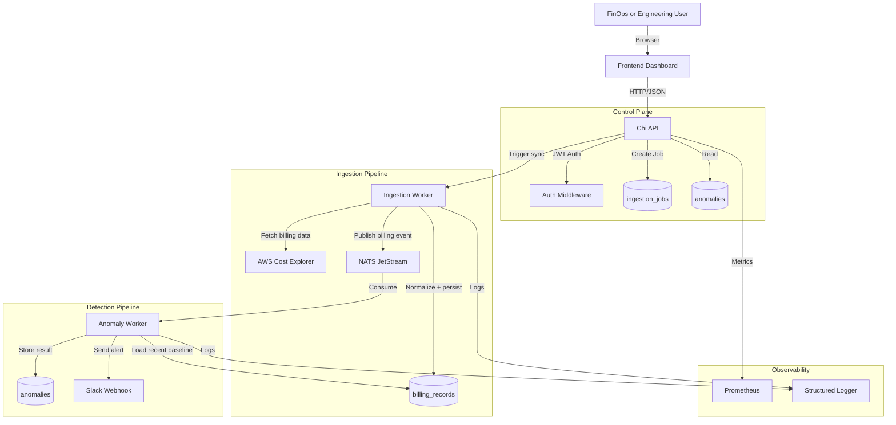

# 🛡️ Atomity Cost Guard: Multi-Cloud Anomaly Detector

> **Internship-Focused Backend MVP for Cloud Cost Anomaly Detection**  
> *Built with Go | Chi Router | NATS JetStream | PostgreSQL | AWS SDK v2 | React/Next.js*

[](https://golang.org)
[](LICENSE)
[]()

---

## 🚀 Project Summary

This project is a deliberately scoped MVP built to demonstrate backend engineering judgment for an internship conversation. It tackles a real problem, cloud cost anomaly detection for AI-heavy workloads, while staying small enough to design, build, explain, and defend within a few days.

The system ingests AWS billing data, stores normalized cost records, runs anomaly detection using a simple statistical baseline, and surfaces suspicious spikes through a small dashboard and Slack alerts.

The point of the project is not to claim a finished startup platform. The point is to show the ability to make sensible tradeoffs, build an event-driven backend, integrate cloud APIs, and present a realistic path from MVP to production.

---

## 🎯 Why This Is a Strong Internship Project

This README is written to highlight engineering signal first.

- **Real problem selection:** Cost spikes in GPU and cloud workloads are a concrete operational issue, not a toy CRUD example.
- **Strong backend scope:** The project covers API design, async processing, job orchestration, persistence, observability, and third-party integrations.
- **Good product judgment:** The MVP stays AWS-first and avoids pretending to solve every cloud problem at once.
- **Discussable tradeoffs:** Every major choice has a reason that can be defended in an interview.
- **Visible demo path:** A reviewer can understand the flow quickly: trigger ingestion, process records, detect anomalies, send alert.

---

## 💡 Problem and Outcome

**Problem:** AI startups and infrastructure teams often discover unusual cloud spend too late. Billing dashboards are useful for analysis, but they are not designed for fast operational feedback.

**MVP Outcome:** This project turns billing data into a lightweight detection pipeline that can flag suspicious spend shortly after ingestion instead of waiting for manual review.

### What the MVP demonstrates
- Building a backend service in Go with clean request boundaries
- Designing an async pipeline with NATS JetStream
- Modeling operational data in PostgreSQL
- Integrating with AWS Cost Explorer and Slack
- Scoping an end-to-end product surface in four days

### What it does not pretend to be
- A finished multi-cloud platform
- A full FinOps suite
- A production-hardened forecasting engine
- A complete enterprise dashboard product

---

## 📈 Practical Value

| Metric | Traditional Tools | Atomity Cost Guard |
| :--- | :--- | :--- |
| **Detection Time** | Manual review after billing sync | **Near real-time after ingestion** |
| **Cost Visibility** | Delayed dashboards | **Recent usage summary + alerts** |
| **Response Style** | Reactive | **Early warning workflow** |
| **Project Value** | Hard to evaluate engineering ability | **Clear backend execution sample** |

---

## 🏗️ System Architecture

Designed as a compact backend system with a clear separation between request handling, ingestion, async detection, and alert delivery. The goal is to keep the MVP small enough to build in four days while still showing sound system design choices.



### Request and Processing Flow
1. **Authenticated trigger:** A protected API endpoint starts an ingestion job for a given account and date range.
2. **Job tracking:** The API records job state in PostgreSQL so the system can show whether a sync is pending, running, succeeded, or failed.
3. **AWS ingestion:** The ingestion worker pulls billing data from AWS Cost Explorer, normalizes it, and stores billing records.
4. **Event publication:** Each ingestion batch publishes an event to JetStream so anomaly detection runs asynchronously.
5. **Anomaly detection:** The detector compares recent spend against a simple historical baseline using Z-Score logic.
6. **Alert delivery:** High-signal anomalies are written to the anomalies table and pushed to Slack.

### Component Responsibilities
- **Frontend Dashboard:** Simple operator UI for login, manual ingestion trigger, anomaly table, and job status visibility.
- **Chi API:** Authentication, manual ingestion trigger, health endpoint, anomaly listing, and metrics exposure.
- **PostgreSQL:** Source of truth for billing records, anomaly results, and ingestion job status.
- **NATS JetStream:** Decouples ingestion from detection so failures in one step do not block the other.
- **Ingestion Worker:** Handles AWS SDK interaction, normalization, and event publication.
- **Anomaly Worker:** Applies detection logic and decides whether an alert should be emitted.
- **Slack Integration:** Makes the MVP visible and operational during demos.

### Key Design Decisions
1.  **Single API plus workers:** Cleaner than pretending there are many microservices, but still demonstrates separation of concerns.
2.  **AWS-first scope:** One provider keeps the MVP finishable while leaving a path for later adapters for GCP and Azure.
3.  **PostgreSQL for job state and results:** Avoids hidden state and makes failures easier to inspect during demos.
4.  **JetStream between ingestion and detection:** Gives retryability and loose coupling without adding unnecessary orchestration.
5.  **Pull from AWS, push to Slack:** Creates a full input-to-decision-to-alert loop that is easy to explain to interviewers.
6.  **Simple statistical baseline:** Z-Score is enough for an MVP and easier to defend than prematurely adding advanced forecasting.

### Why This Architecture Works for an MVP
- It is small enough to implement quickly.
- It still shows real backend engineering tradeoffs: async processing, persistence, observability, and external integrations.
- It includes a usable frontend surface without forcing a large product build.
- It avoids fake complexity such as premature multi-cloud parity, service mesh concerns, or overbuilt forecasting layers.
- It gives a strong discussion path for future improvements like scheduled ingestion, provider adapters, and richer anomaly models.

---

## 🖥️ Frontend MVP

The frontend exists to make the system easy to demo. It is intentionally thin and operational, not product-heavy.

### Recommended Scope
- Login screen using JWT-based auth
- Dashboard page with latest anomalies
- Manual ingestion form with account ID and date range
- Job status panel showing pending, running, succeeded, or failed
- Small summary cards for recent spend, anomaly count, and last sync time

### Recommended Stack
- **Frontend:** React or Next.js
- **Styling:** Tailwind CSS or simple component styling
- **Charts:** Recharts for one spend trend chart
- **Auth Handling:** Store JWT client-side for the MVP only

### What the UI Should Show
1. **Top summary row:** Last sync time, number of anomalies, and accounts monitored.
2. **Ingestion control:** A form to trigger new billing ingestion manually.
3. **Anomaly table:** Service, account, amount, expected baseline, anomaly score, and timestamp.
4. **Trend chart:** Daily spend trend for the selected account.
5. **Job history:** Recent ingestion jobs with status and error message if one failed.

### Why This Frontend Is the Right Size
- It proves the backend is usable.
- It gives a cleaner demo than raw API calls alone.
- It stays small enough to finish within the four-day limit.
- It avoids wasting time on design-heavy flows like multi-tenant settings, billing exports, or complex role management.

### What to Avoid in the MVP
- Full design system work
- Complex state management libraries
- Multi-page onboarding flows
- Advanced data visualization beyond one useful chart
- Real-time websockets unless they are already trivial to add

---

## 📅 4-Day MVP Scope

This scope is intentionally constrained. That is part of the pitch, not a weakness.

### Day 1
- Project setup, configuration, database schema, and Docker Compose
- Health endpoint and basic authenticated API structure

### Day 2
- AWS billing ingestion flow using AWS SDK v2
- Persist normalized billing records in PostgreSQL

### Day 3
- Publish ingestion events to NATS JetStream
- Run Z-Score anomaly checks and store anomaly results

### Day 4
- Slack alert integration
- Basic frontend dashboard for demoability
- Metrics endpoint, README cleanup, and demo-ready polish

### In Scope
- AWS-only ingestion
- One anomaly detection method: Z-Score
- REST API for triggering ingestion and listing anomalies
- Small frontend dashboard for operators
- Slack notifications for detected spikes
- Docker Compose local setup

### Out of Scope for MVP
- Full AWS, GCP, and Azure parity
- Holt-Winters or advanced forecasting models
- gRPC service split
- Redis-backed rate limiting
- Complex frontend workflows and role-based admin panels
- Production hardening and large-scale partitioning

---

## 🛠️ Tech Stack & Skills Demonstrated

| Component | Technology | Purpose |
| :--- | :--- | :--- |
| **Language** | Go 1.21+ | Core logic, concurrency |
| **Frontend** | React or Next.js | Operator dashboard for demo and control |
| **HTTP Framework** | Chi Router | REST API, middleware chain |
| **Message Broker** | NATS JetStream | Event-driven anomaly pipeline |
| **Database** | PostgreSQL + pgx | Persistent storage, complex queries |
| **Cloud SDK** | AWS SDK v2 | Billing data ingestion |
| **Auth** | JWT | Secure API access |
| **Observability** | Prometheus | Metrics & monitoring |
| **Deployment** | Docker Compose | Local development & testing |

---

## 🧠 Engineering Decisions Worth Discussing

These are the choices that make the project useful in an interview:

1. **AWS-first instead of fake multi-cloud parity**
    A narrow but working integration is more credible than three half-implemented adapters.
2. **Event-driven detection instead of inline request processing**
    Ingestion and anomaly detection are separated so the API stays simple and failures are easier to reason about.
3. **PostgreSQL as the source of truth**
    Job state, billing records, and anomaly results stay queryable and easy to inspect.
4. **Simple anomaly logic first**
    Z-Score is enough to demonstrate the pipeline without overpromising ML sophistication.
5. **Small frontend, strong backend**
    The dashboard supports the demo, but the engineering depth stays where it matters most.

---

## 🎬 Demo Flow

The demo story is straightforward:

1. Sign in to the dashboard.
2. Trigger a billing ingestion job for a selected AWS account and date range.
3. Show the job move through pending, running, and completed states.
4. Display newly ingested records and flagged anomalies.
5. Show the Slack alert for a high-signal anomaly.

This flow gives interviewers something concrete to evaluate: API design, async processing, data flow, and product thinking.

---

## ⚡ Quick Start

Get the MVP running locally in **5 minutes** using Docker Compose.

### Prerequisites
- Docker & Docker Compose
- AWS Credentials (Read-only Cost Explorer access)
- Slack Webhook URL

### Installation

1.  **Clone the Repository**
    ```bash
    git clone https://github.com/yourusername/atomity-cost-guard.git
    cd atomity-cost-guard
    ```

2.  **Configure Environment**
    ```bash
    cp .env.example .env
    # Edit .env with your AWS Credentials, JWT Secret, and Slack Webhook
    ```

3.  **Run Services**
    ```bash
    docker-compose up --build
    ```
    *This starts: API, NATS, PostgreSQL, and Prometheus.*

4.  **Verify Health**
    Open `http://localhost:8080/health` in your browser.

---

## 🔌 API Reference

### REST Endpoints (Chi Router)
| Method | Endpoint | Description | Auth |
| :--- | :--- | :--- | :--- |
| `GET` | `/health` | Service health check | None |
| `POST` | `/api/v1/ingest` | Trigger billing data ingestion | JWT |
| `GET` | `/api/v1/anomalies` | List detected cost anomalies | JWT |
| `GET` | `/metrics` | Prometheus metrics | None |

**Example Request (REST):**
```bash
curl -X POST http://localhost:8080/api/v1/ingest \
  -H "Authorization: Bearer YOUR_JWT_TOKEN" \
  -H "Content-Type: application/json" \
  -d '{"account_id": "123456789", "days": 7}'
```

---

## 🔒 Security & Resilience

### Authentication
- **JWT Based:** All protected endpoints require a valid JSON Web Token.
- **Middleware:** Custom Chi middleware handles token validation, expiration checks, and user context injection.

### Resilience Patterns
- **Retries:** Exponential backoff strategy for transient network errors.
- **Event Buffering:** NATS JetStream keeps ingestion and detection loosely coupled.

### Data Security
- **Secrets Management:** No hardcoded credentials. Secrets injected via environment variables.
- **Structured Logging:** Sensitive data (API keys, PII) is automatically redacted in logs.

---

## 📊 Observability

### Prometheus Metrics
The service exposes key FinOps and system metrics:
- `billing_ingestion_duration_seconds`: Histogram of ingestion times.
- `anomaly_detection_total`: Counter of detected anomalies by severity.
- `aws_api_errors_total`: Counter of AWS API failures.
- `http_requests_total`: Standard HTTP request metrics.

### Scraping Config
```yaml
scrape_configs:
  - job_name: 'cost-guard'
    static_configs:
      - targets: ['localhost:8080']
```

---

## 🧩 Why This Fits Atomity

This MVP is aligned with the kind of backend and FinOps problems Atomity operates on, while staying small enough to be completed and explained clearly in an interview setting.

1.  **FinOps First:** It moves cost management from reactive billing reviews to proactive engineering alerts.
2.  **Expandable Design:** The data model and event flow can later support GCP and Azure without requiring them in the first build.
3.  **AI Workload Focus:** The anomaly use case maps well to bursty GPU training and inference spend.
4.  **Engineering Signal:** It demonstrates event-driven design, backend API development, observability, and cloud integration without pretending to be a finished platform.

> **Discussion Angle:** A compact MVP is often stronger than an oversized architecture diagram. The project is scoped to show execution, prioritization, and sound backend judgment.

---

## ✅ Internship Takeaway

If this project does its job well, a reviewer should come away with four conclusions:

- The candidate can choose a meaningful problem.
- The candidate can scope an MVP realistically.
- The candidate understands backend system design beyond basic CRUD.
- The candidate can explain tradeoffs clearly and build toward a demoable result.

---

## 📄 License

MIT License - See [LICENSE](LICENSE) for details.

---

## 🤝 Contact & Portfolio

**Built by:** Nishant Raj  

**LinkedIn:** https://www.linkedin.com/in/nraj24/

**Email:** nraj02415@gmail.com

**Seeking:** Backend, cloud, or platform engineering internship opportunities

*Open to discussing the system design, tradeoffs, and how this MVP could be extended in a production setting.*